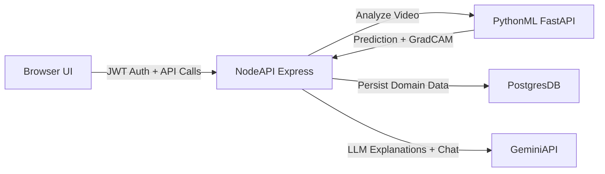

# DEEPFAKE.DETECT

Forensic video-analysis platform with a hardened Node.js API, a FastAPI deepfake model service, and a cohesive operator dashboard.

Designed for security-first triage workflows, this stack combines frame-level model scoring, Grad-CAM visual evidence, audit trails, and admin review operations.

The system is optimized for local Docker deployments with offline-capable authentication and extensible model infrastructure.

<!--  -->

## Architecture

## Prerequisites

- Docker Desktop (or Docker Engine + Compose plugin)
- Node.js 20+ (for local script execution)
- Python 3.11 (only if running python-service outside Docker)

## Quick Start

1. Copy and configure environment variables:
   - `cp .env.example .env`
2. Start all services:
   - `docker compose up --build`
3. Open:
   - `http://localhost:3000`

## Security Highlights

- Explicit CSP via `helmet` with scoped third-party sources
- Authenticated Grad-CAM retrieval (`/gradcams/:filename`) with per-user authorization
- CORS allowlist via `ALLOWED_ORIGINS`
- File upload hardening with mime magic-byte verification and strict size limits
- Route-level rate-limiting by IP and user
- Environment schema validation on startup (`zod`)

## Development Scripts

From `node-app`:

- `npm run dev`
- `npm run lint`
- `npm run db:seed`
- `npm run db:seed:demo`

## Demo Seeding

Run:

- `npm run db:seed:demo`

This seeds:
- 3 users (admin, analyst, field-operative)
- 6 analysis records
- 4 review queue items
- 1 demo chat session

If demo data is already present, the script exits cleanly without duplication.
